# 🛍️ Moji Accessories & Gifts Website Clone

Cloned the Accessories & Gifts website to practice frontend and backend development.

---

## 📌 Features

### 👤 Role: Customer
- 📝 Sign up / Sign in
- 🛒 Cart Management (Add, update, remove products)
- 📦 Order Management (Create, cancel, track order status)
- 💳 Payment
- 🧾 Product (View and search for products by name)
- 👤 Edit Profile
### 🛠️ Role: Admin
- 🧾 Product Management (Add, update, delete products)
- 📦 Order Overview (View and manage all customer orders)
- 👤 User Management (View customer list, manage accounts)

---
## 🚀 Tech Stack

- **Frontend:** HTML, CSS, Javascript and Bootstrap
- **Backend:** Java Spring MVC
- **Database:** SQL Server

---

## 🛠️ Installation & Run

### ✅ Requirements
- **Java JDK 22**
- **Apache Tomcat 10.1+**
- **Maven 3.6+**
- **Frontend**: HTML, CSS, Bootstrap, JavaScript

---

### 🔧 Step-by-step Setup

#### 🥇 Step 1: Clone the Project
```bash
git clone https://github.com/sewaobe/ProjectWeb_Tool.git
cd ProjectWeb_Tool
```

#### 🥈 Step 2: Build the Backend Project with Maven
```bash
mvn clean package
````
#### 🥉 Step 3: Deploy to Apache Tomcat
```bash
# Replace the path with your actual Tomcat directory
cp target/ProjectWeb-1.0.war /path/to/apache-tomcat-10.1.x/webapps/
````
#### 🏁 Step 4: Start Apache Tomcat
```bash
# For Linux/macOS
/path/to/apache-tomcat-10.1.x/bin/startup.sh

# For Windows
path\to\apache-tomcat-10.1.x\bin\startup.bat
````
#### 🌍 Step 5: Open the Web App in Browser
```bash
http://localhost:8080/ProjectWeb
````
---

## 📸 Screenshots

### 👤 Role: Customer

#### 🔐 Login
<p align="center">
  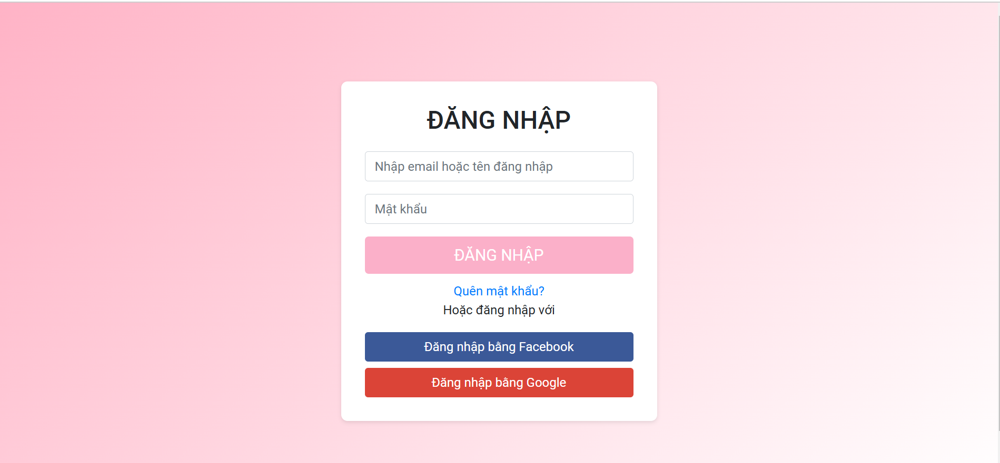
</p>

#### 📝 Register
<p align="center">
  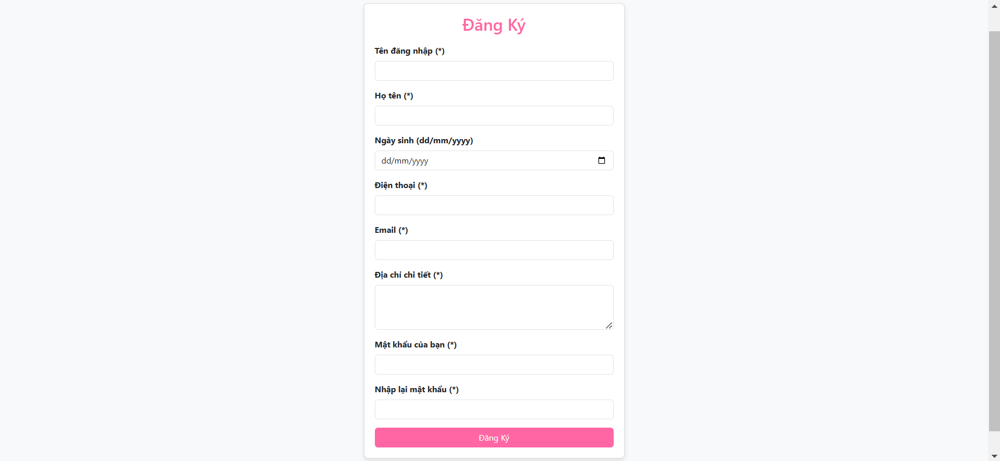
</p>

#### 👤 Profile
<p align="center">
  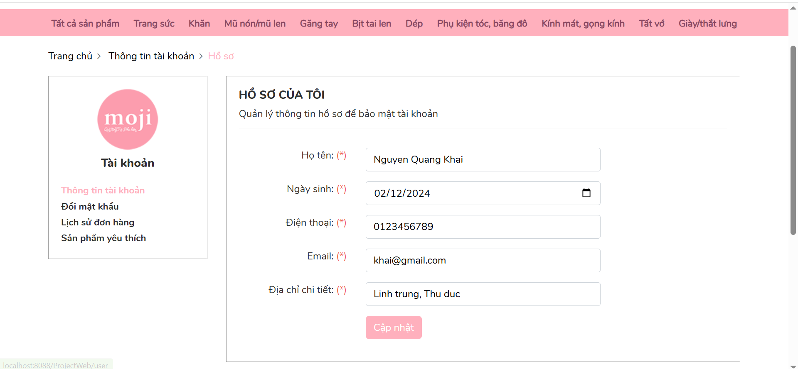
</p>

#### 🏠 Home Page
<p align="center">
  
</p>

#### 🛒 Cart
<p align="center">
  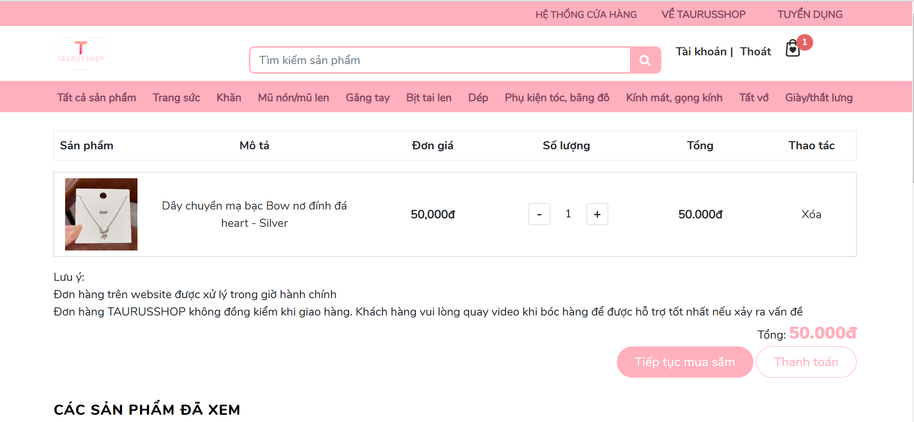
</p>

#### 💳 Payment
<p align="center">
  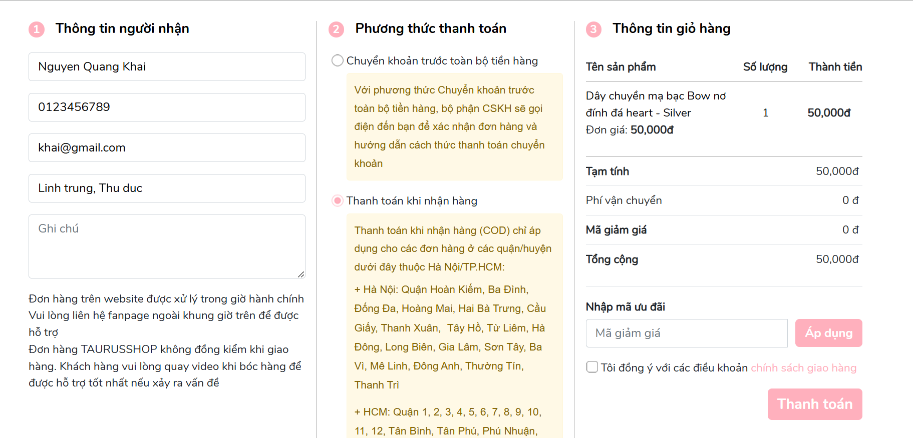
</p>

#### 📦 Order Tracking
<p align="center">
  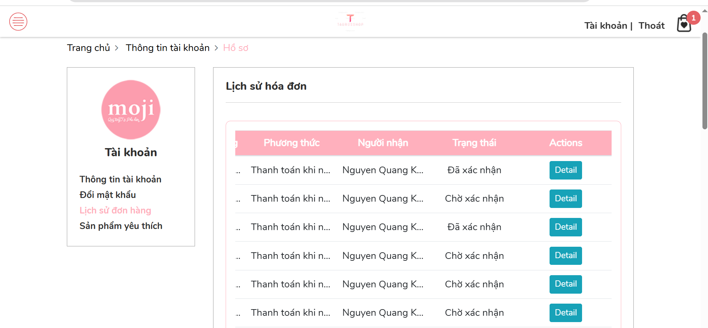
</p>

---

### 🛠️ Role: Admin

#### 📦 Order Management
<table>
  <tr>
    <td align="center"><strong>Desktop View</strong></td>
    <td align="center"><strong>Responsive View</strong></td>
  </tr>
  <tr>
    <td>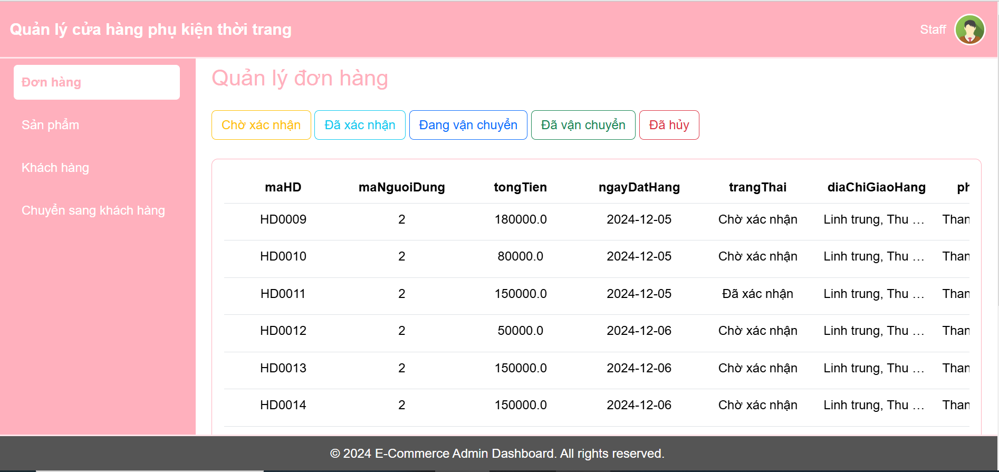</td>
    <td>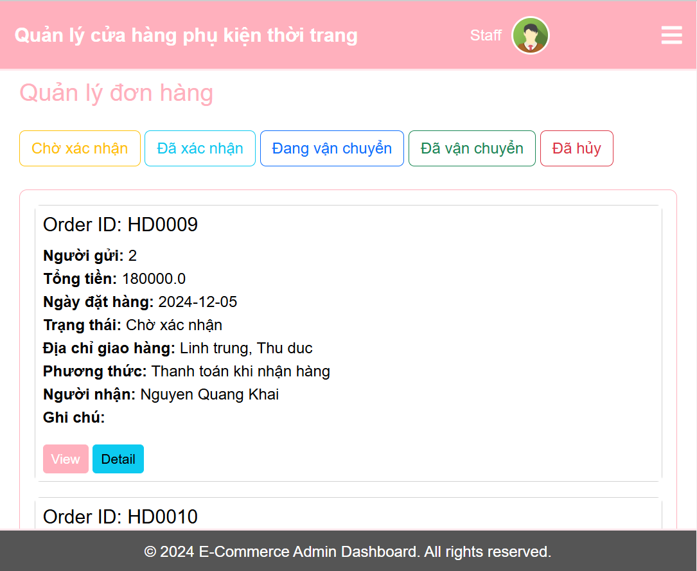</td>
  </tr>
</table>

##### Edit Order
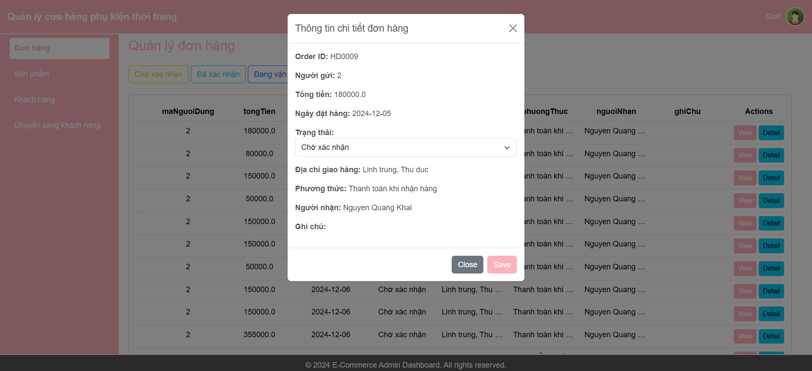

#### 📦 Product Management
<table>
  <tr>
    <td align="center"><strong>Desktop View</strong></td>
    <td align="center"><strong>Responsive View</strong></td>
  </tr>
  <tr>
    <td>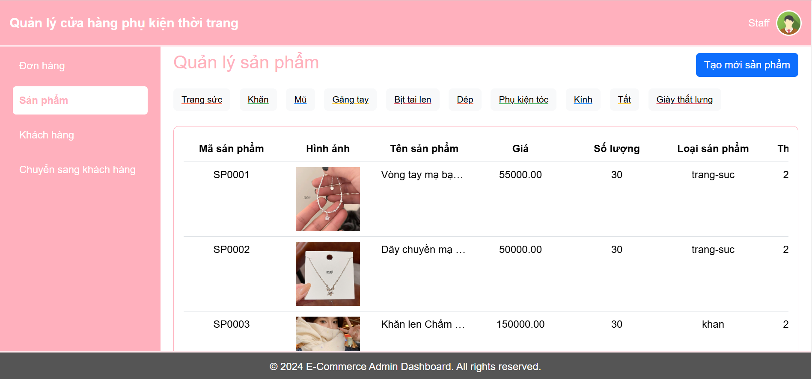</td>
    <td>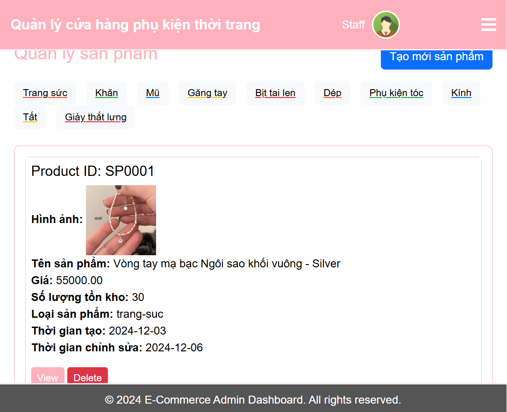</td>
  </tr>
</table>

##### Edit Product
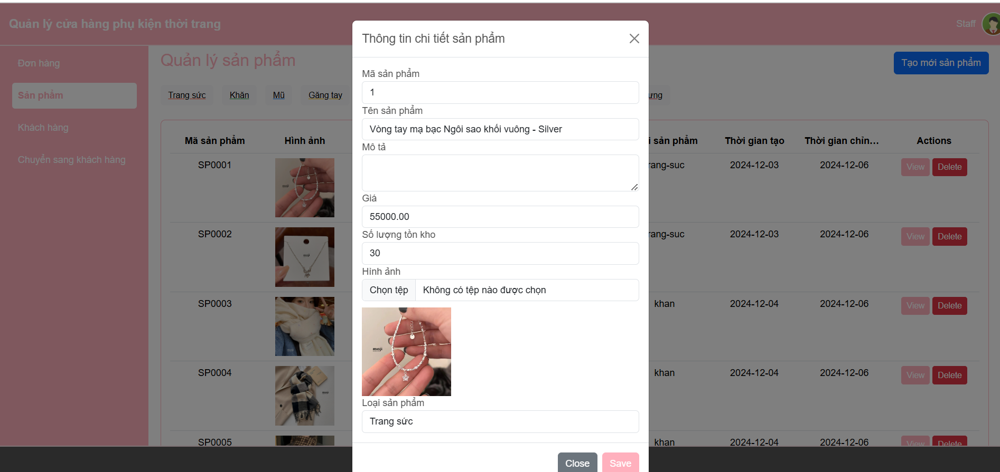

#### 👥 Customer Management
<table>
  <tr>
    <td align="center"><strong>Desktop View</strong></td>
    <td align="center"><strong>Responsive View</strong></td>
  </tr>
  <tr>
    <td>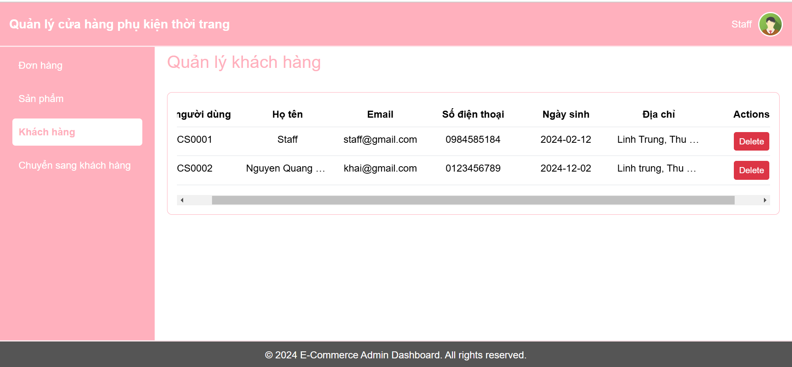</td>
    <td>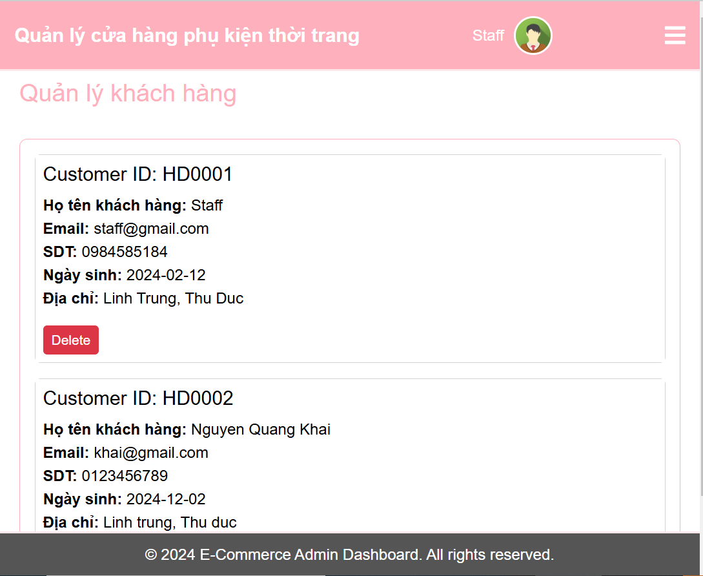</td>
  </tr>
</table>
